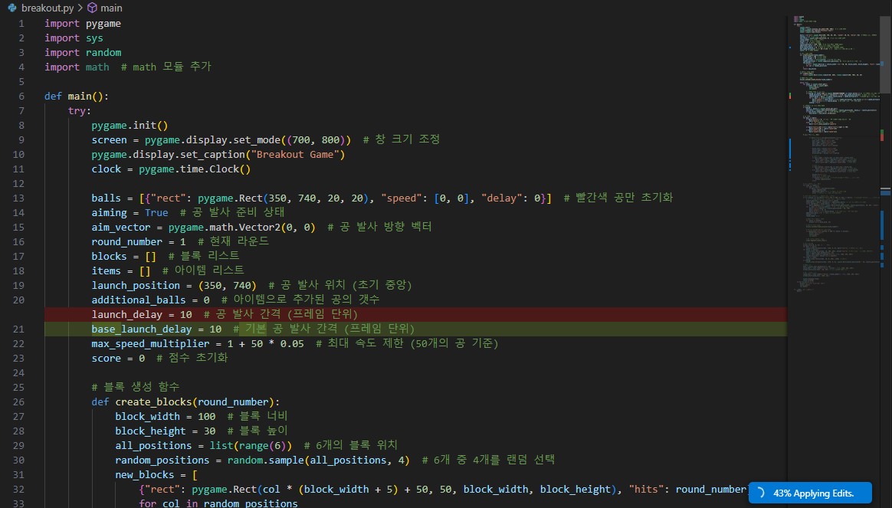
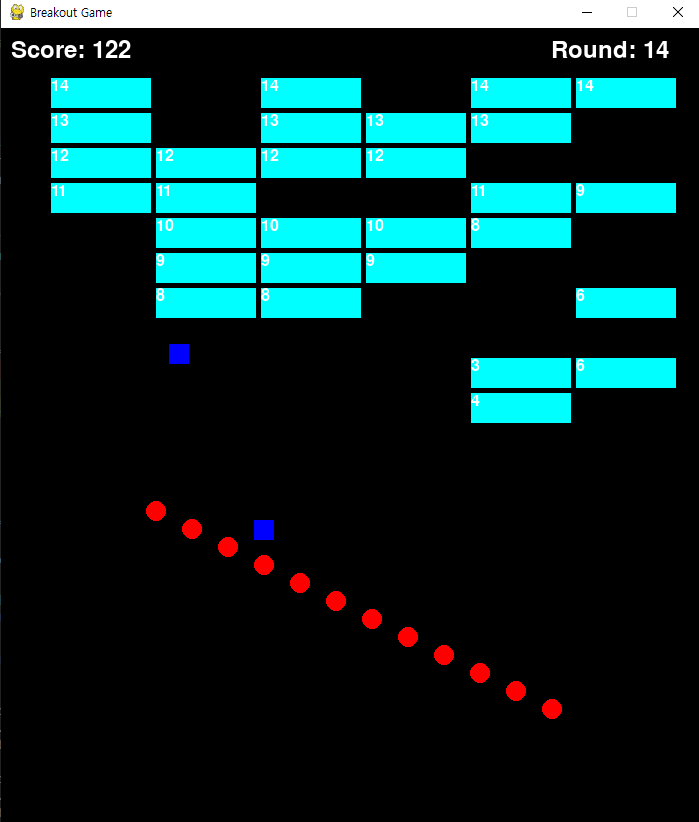

# game_breakout
## 2025 AI 소프트웨어 전문가 양성 교육 3번째 수업에 만든 게임입니다.

# VScode 기능 중 copilot 기능 사용
## 제작 과정
### ctrl+shift+i를 이용해 copilot 채팅 창을 엽니다.

### gitgub 계정을 통해 로그인을 합니다.

### 원하는 프로젝트를 copilot에게 요구합니다.
![image_3}(image/chat_copilot_1.png)
### copilot이 요구한 프로젝트의 프로그램을 작성해줍니다.

## 결과 확인
### 게임을 실행 했을 때 화면입니다.

### 2라운드부터 파란색 아이템이 생성되고 아이템을 먹으면 공이 늘어나고 공으로 해당 블럭을 히트해서 깨는 방식의 게임입니다.
