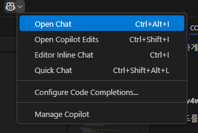
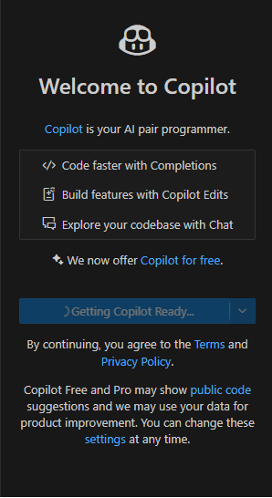

# game_breakout
## 2025 AI 소프트웨어 전문가 양성 교육 3번째 수업에 만든 게임입니다.

# VScode 기능 중 copilot 기능 사용

## ctrl+shift+i를 이용해 copilot 채팅 창을 엽니다.

## gitgub 계정을 통해 로그인을 합니다.
![image_3}(image/chat_copilot_1.png)
## 원하는 프로젝트를 copilot에게 요구합니다.
